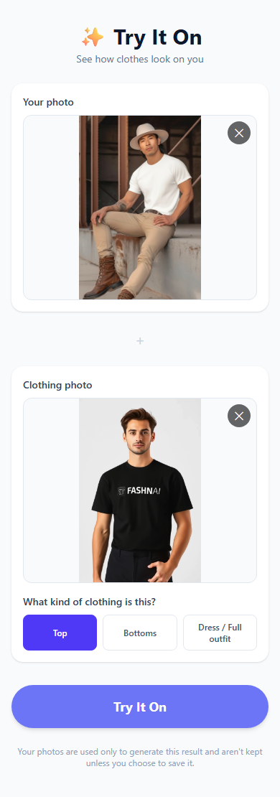

# Development

## Milestone plan & status

| # | Milestone | Status |
|---|---|---|
| 1 | Hardware & AI model evaluation | ✅ Done |
| 2 | AI model installation & first test inference | ✅ Done |
| 3 | AI inference FastAPI service (`POST /api/try-on`) | ✅ Done |
| 4 | Mobile-first web UI | ✅ Done |
| 5 | Connect frontend to AI backend | ✅ Done as part of Milestone 4 — the frontend calls the real `/api/try-on` from the start, not mock data |
| 6 | User accounts & secure image handling | ✅ Done |
| 7 | Product image extraction | ⬜ Not started |
| 8 | Product URL support | ⬜ Not started |
| 9 | Browser extension | ⬜ Not started |
| 10 | PWA / mobile optimization | ⬜ Not started |
| 11 | Usage limits & premium architecture | ⬜ Not started |
| 12 | Payments / in-app purchases | ⬜ Not started |
| 13 | Production deployment | ⬜ Not started |

## Hardware this project was developed on

- Windows 11 Home, AMD Ryzen 3 7330U (4C/8T), 15 GB RAM, AMD integrated graphics (no CUDA).
- **No GPU acceleration available on this machine.** All local AI work runs on CPU. This is fine for development/correctness testing but too slow for production — see [ARCHITECTURE.md](ARCHITECTURE.md#dev-environment-vs-inference-environment) for the planned split.

## Python versions — do not break the system default

This machine's default `python`/`py` is **3.14.7** — left completely untouched. The AI environment uses a **separate Python 3.11.9**, installed side-by-side via:

```powershell
winget install --id Python.Python.3.11 -e --scope user --silent --override "/quiet InstallAllUsers=0 PrependPath=0 Include_launcher=1"
```

This does **not** add 3.11 to PATH or change what `python` resolves to system-wide; it's only reachable via its full path or the `py -3.11` launcher. Why 3.11: it's what `fashn-vton-1.5` is built and tested against (`requires-python = ">=3.10"`, tested on 3.10–3.12); the wider ML dependency chain (onnxruntime, opencv-python, etc.) has solid prebuilt Windows wheels for it. Python 3.14 is not used for AI work — PyTorch itself added 3.14 support recently, but several smaller pinned dependencies in this chain don't reliably ship 3.14 wheels yet.

> **Gotcha hit during setup:** the first `winget install` attempt hung indefinitely because the Windows Installer service (`msiserver`) was stopped and the sandboxed session couldn't start it implicitly. Fix: `Start-Service msiserver` once, then retry the winget install — it completes in under a minute.

## AI environment setup (from scratch)

```powershell
cd "ai"
& "$env:LOCALAPPDATA\Programs\Python\Python311\python.exe" -m venv .venv
.venv\Scripts\python.exe -m pip install --upgrade pip
.venv\Scripts\python.exe -m pip install torch torchvision --index-url https://download.pytorch.org/whl/cpu
.venv\Scripts\python.exe -m pip install -e ".\vendor\aitryon-bodyparser"
.venv\Scripts\python.exe -m pip install -e ".\vendor\fashn-vton-1.5"
.venv\Scripts\python.exe inference\download_weights.py --weights-dir "models\fashn-vton-1.5"
```

Notes:
- `torch`/`torchvision` are installed from PyTorch's dedicated **CPU** wheel index — installing the default `pip install torch` would pull ~2.5GB of unneeded CUDA runtime libraries this machine can never use.
- `ai/vendor/fashn-vton-1.5` is a vendored, locally-modified clone of https://github.com/fashn-AI/fashn-vton-1.5 (Apache-2.0). The only modifications: `pyproject.toml` no longer depends on `fashn-human-parser`, and two files (`pipeline.py`, `preprocessing/agnostic.py`) import our own `aitryon_bodyparser` package instead. See [AI_MODEL_LICENSE.md](AI_MODEL_LICENSE.md) for why, and the module docstring in `ai/vendor/aitryon-bodyparser/src/aitryon_bodyparser/parser.py` for exactly when that placeholder stops being valid and must be upgraded to a real segmentation model.
- `ai/vendor/aitryon-bodyparser` is our own small MIT-licensed package — not a fork of anything.
- Weights land in `ai/models/fashn-vton-1.5/` (gitignored — ~2GB, never commit).

## Running the first test inference

```powershell
cd "ai"
.venv\Scripts\python.exe inference\test_first_tryon.py
```

Uses fashn-vton-1.5's own bundled example images (a person photo + a garment photo) and writes `ai/outputs/milestone2_first_tryon.png`. Expect this to be slow — this machine has no GPU; see the script's timing output for the actual measured figure once it's run to completion.

## Known limitation carried forward from Milestone 2

`aitryon_bodyparser.PlaceholderBodyParser` always returns "background" — it is not a real segmentation model. It's provably safe only when the pipeline runs with `segmentation_free=True` and `garment_photo_type="flat-lay"` (our actual MVP scenario: a person photo + a plain clothing/product photo). The backend API enforces this — see Milestone 3 below. Before we support masked mode or "garment worn by another person" product photos, it must be replaced with a real commercially-licensed segmentation model. Candidates and why: see [AI_MODEL_LICENSE.md](AI_MODEL_LICENSE.md).

## Milestone 3 — AI inference FastAPI service

`backend/` is a FastAPI app that wraps the AI pipeline behind `POST /api/try-on`. It runs in the same venv as `ai/` (`ai/.venv`) since it calls the pipeline in-process — see `backend/requirements.txt` for why, and when that would need to split.

**Install (adds to the same venv):**
```powershell
ai\.venv\Scripts\python.exe -m pip install -r backend\requirements.txt
ai\.venv\Scripts\python.exe -m pip install pytest httpx   # test-only deps
```

**Run the server:**
```powershell
ai\.venv\Scripts\python.exe -m uvicorn backend.app.main:app --reload
```
Loads the real model at startup (~7s) — a missing/corrupt `ai/models/fashn-vton-1.5` fails loudly at boot, not on a user's first request.

**Run tests** (fast — uses a fake provider, no real inference; run from the project root):
```powershell
ai\.venv\Scripts\python.exe -m pytest -v
```

**API:**

| Endpoint | Purpose |
|---|---|
| `POST /api/try-on` | multipart form: `person_image`, `garment_image` (JPEG/PNG/WebP, ≤10MB, ≤4096px), `category` (`tops`\|`bottoms`\|`one-pieces`), optional `num_timesteps`/`seed`. Returns `202 {job_id, status}` immediately — generation runs in the background (this is not optional: on this CPU-only dev machine a job takes 10-70+ minutes depending on step count, so the request must not block). `garment_photo_type` other than the default `"flat-lay"` is rejected with a clear message — see the known limitation above. |
| `GET /api/try-on/{job_id}` | `{status: pending\|processing\|completed\|failed, error, result_url}`. Poll this. |
| `GET /api/try-on/{job_id}/result` | The generated PNG, once `status == completed`. |

**Verified working, twice:**
1. Full test suite (`pytest`, fake provider) — validation, job lifecycle, error handling, rate limiting, 404s, provider-failure-doesn't-leak-internals — all pass in ~1s.
2. A real end-to-end run through the actual running server (real model, `num_timesteps=4` for a faster ~13-minute check) — submit → poll (server stayed responsive to every poll throughout, confirming the background-task design works) → fetch result → confirmed temp uploads were deleted and the result PNG persisted.

**Known limitations at the time, since addressed by Milestone 6 (noted here for history, not left stale):**
- ~~Job state is in-memory~~ → `DbJobStore` (Postgres) is now what `app/main.py` wires up; `InMemoryJobStore` still exists and is still what the fast test suite uses.
- ~~No auth~~ → optional JWT auth exists; still true that the core flow never requires it, by design.
- Rate limiting is still a per-IP (or per-user, if signed in) in-memory fixed window (abuse protection only) — real per-plan quotas still need Milestone 11.
- Temp upload cleanup running in a `finally` block (skipped on a hard process kill) is still a real gap — see Milestone 6's section below for the closely-related result-image TTL story.

## Milestone 4 — Mobile-first web UI

`frontend/` is a Vite + React 19 + TypeScript + Tailwind CSS v4 PWA-shaped app (full PWA installability — manifest icons, service worker — is Milestone 10; this milestone is the responsive UI itself). Talks to the backend over plain `fetch`, configured via `VITE_API_BASE_URL` (`.env.example`).

**Install & run:**
```powershell
cd frontend
npm install
npm run dev          # http://localhost:5173 — CORS-allowed by the backend's default config
```
Needs the backend running too (see Milestone 3 above) — the app calls it directly, no proxy.

**Structure:**
| Path | Purpose |
|---|---|
| `src/screens/{Home,Processing,Result}Screen.tsx` | The three screens from the brief's UI spec |
| `src/hooks/useTryOnFlow.ts` | The whole client-side state machine: selected photos → submit → poll → result/error |
| `src/api/tryOnClient.ts` | Thin fetch wrapper matching the backend's schemas exactly |
| `src/components/PhotoPicker.tsx` | Shared camera/gallery picker; "Take Your Photo" uses `capture="user"` to jump straight to the camera on mobile, "Choose Your Photo"/"Upload Clothing" omit it so the OS offers camera+gallery+files |
| `src/utils/resultActions.ts` | Save (blob download — works cross-origin, unlike a plain `<a download>` on a cross-origin URL) and Share (Web Share API with a file, falling back to download where unsupported, e.g. most desktop browsers) |

**Deliberately not built yet** (later milestones per the brief): "Paste Product URL" (Milestone 8 — the backend has no URL extraction to call), full PWA installability (Milestone 10). Accounts/login shipped in Milestone 6, below — still entirely optional, never forced.

**Verified, not just written** — `npm run build` and `npm run lint` both clean, then a headless-Chromium pass (Playwright, 390×844 mobile viewport, no project `run` skill existed yet so this used the generic browser-driven pattern) against the actual running frontend+backend:
- Home screen renders correctly at mobile width, matches the brief's wireframe (screenshot below)
- Submit button correctly starts disabled, enables once both photos are selected, disables again if a photo is removed
- Selecting photos shows live previews with a working remove button; picking a garment reveals the category selector
- Submitting calls the real `POST /api/try-on`, transitions to the processing screen, zero console errors throughout
- Did *not* wait for a real submission to finish in this pass (proven separately and repeatedly in Milestones 2-3 — a generation takes 10-70+ minutes on this CPU-only machine, which the processing screen's copy sets expectations for)



**Known gap:** killing the dev server mid-job (as happened once while smoke-testing) leaves that job's temp files behind — same root cause as the backend gap noted above.

## Milestone 6 — User accounts & secure image handling

Real persistence (PostgreSQL + SQLAlchemy + Alembic) and optional accounts (JWT auth). See [ARCHITECTURE.md](ARCHITECTURE.md#accounts--auth-milestone-6) for the design, [ENVIRONMENT.md](ENVIRONMENT.md) for what got installed.

**One-time setup (already done on this machine, documented for a fresh one):**
```powershell
winget install --id PostgreSQL.PostgreSQL.17 -e --silent --accept-package-agreements --accept-source-agreements --override "--mode unattended --superpassword devpassword --servicename postgresql-x64-17 --serverport 5432"
$env:PGPASSWORD = "devpassword"
& "C:\Program Files\PostgreSQL\17\bin\psql.exe" -U postgres -h localhost -c "CREATE DATABASE aitryon;"

ai\.venv\Scripts\python.exe -m pip install sqlalchemy alembic psycopg2-binary bcrypt pyjwt email-validator
```

**Every time you pull schema changes:**
```powershell
cd backend
..\ai\.venv\Scripts\python.exe -m alembic upgrade head
```

**New endpoints:**

| Endpoint | Auth | Purpose |
|---|---|---|
| `POST /api/auth/signup` | — | `{email, password}` → `{access_token}` |
| `POST /api/auth/login` | — | Same response shape. Wrong password and unknown email return the *identical* message/status, so a login attempt can't be used to enumerate registered emails |
| `GET /api/auth/me` | required | Current user's `{id, email, plan, created_at}` |
| `POST /api/try-on` | optional | Unchanged contract — an `Authorization: Bearer` header just attributes the job to that user |
| `POST /api/try-on/{job_id}/save` | required | Marks a completed job `saved` (exempt from the TTL cleanup below). Only the job's own creator can call this — 403 for anyone else, 403 for an anonymous job even from a now-signed-in user (no retroactive claiming) |

**Frontend:** `useAuth.ts` (token in `localStorage`, wrapped in try/catch — see the hook for why), `AuthBar`/`AuthModal` components (a small "Sign in" link on the home screen, not a gate on anything), and `ResultScreen`'s new "Save to my account" button, shown only when signed in, alongside the pre-existing device "Save".

**A real bug caught mid-build, not shipped:** the first migration had no `ON DELETE` behavior on `jobs.user_id`, so deleting a user with existing jobs would have failed with a foreign-key violation. Caught while writing the *test cleanup fixture* (deleting a test user after a test that created a job for them failed) — fixed by adding `ondelete="CASCADE"` to the FK (and a SQLAlchemy naming convention on `Base.metadata`, since the fix also surfaced that Alembic can't autogenerate a migration for an unnamed constraint). Migration history was reset once, cleanly, since this was still pre-any-real-data.

**Verified, in order:**
1. `pytest` — 8 pre-existing tests (unaffected, still DB-free) + 9 new tests in `tests/test_auth_api.py` (signup, duplicate-email rejection, login success/failure with the identical-message check, `/me`, save-by-owner, save-requires-auth, can't-save-someone-else's-or-an-anonymous-job, save-unknown-job). The new file auto-skips (not fails) if Postgres isn't reachable, so the suite stays runnable without it.
2. The real running server: signup → login → `/me` → duplicate signup (409) → wrong password (401, identical message to unknown-email) — all via `curl`.
3. A real authenticated generation (`num_timesteps=4`, real model) through to `/save`, then confirmed a second account gets 403 trying to save the same job.
4. Playwright against the real frontend+backend: opened the sign-in modal, switched to sign-up, created an account, confirmed the header updates to show the signed-in email — zero console errors.
5. Confirmed the `ON DELETE CASCADE` fix for real: deleting a test user whose job was still in the database succeeded and took the job row with it (checked in `psql` before and after).

**Known limitations, carried forward on purpose:**
- `backend/scripts/cleanup_expired_results.py` (the "unsaved images are temporary" enforcement) exists and works but isn't wired to a scheduler yet — needs real infra (cron/Task Scheduler/hosted cron), out of scope for this milestone.
- Account deletion isn't a feature yet (no endpoint) — the cascade behavior is in place for when it is.
- `plan` is a free-text column defaulting to `"free"`; nothing reads or enforces it yet (Milestone 11).
